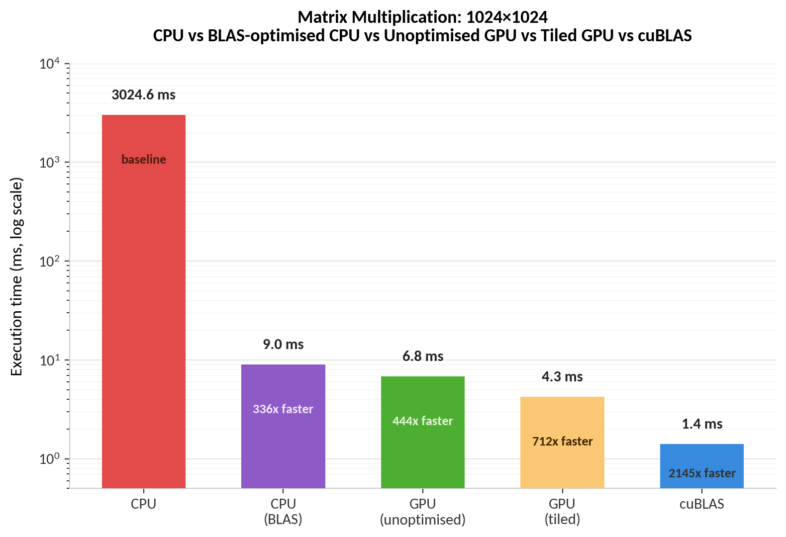

# CUDA Matrix Multiplication: Naive, Tiled, and cuBLAS

A study of GPU matrix multiplication optimisation, comparing a CPU baseline against three CUDA implementations of increasing sophistication:

* a naive one-thread-per-element kernel,
* a shared-memory tiled kernel,
* and NVIDIA's cuBLAS library.

The goal wasn't just to get GPU code working, but to understand why each optimisation step improves performance: specifically, how global memory access patterns become the bottleneck in naive GPU code, and how shared-memory tiling reduces redundant memory traffic.

## Problem

Given two matrices A (M×K) and B (K×N), compute C = A × B (M×N), where each element is a dot product:

All four implementations solve the exact same problem at the same size (1024×1024×1024) and are verified against each other for correctness.

## Implementations

| File | Description |
|---|---|
| `matrix-multiplication-cpu.cpp` | Sequential triple-nested-loop baseline on CPU |
| `matrix-multiplication-naive.cu` | One CUDA thread per output element, reading directly from global memory |
| `matrix-multiplication-tiling.cu` | Shared-memory tiled kernel — cooperative loading, staged computation across tiles |
| `matrix-multiplication-cuBLAS.cu` | NVIDIA's cuBLAS library (`cublasSgemm`) as a production-grade reference point |

## Results

Matrices: 1024 × 1024 × 1024, filled with 1s (so every correct output element equals 1024 — used as the verification check in every version).

| Version | Time | Speedup vs CPU | Speedup vs naive GPU |
|---|---|---|---|
| CPU | 3024.56 ms | 1× | — |
| CPU (BLAS) | 9.02 ms | ~335× | — |
| GPU naive | 6.82 ms | ~444× | 1× |
| GPU tiled | 4.25 ms | ~712× | ~1.60× |
| cuBLAS | 1.41 ms | ~2145× | ~4.83× |

*Hardware: NVIDIA GeForce GTX 1660 Super. GPU kernel times measured with `cudaEvent` (device-side timing, excludes host-device memory transfer). CPU time measured with `std::chrono`, isolated to the compute loop only. CPU (BLAS) time averaged over 3 runs.*

## Why each version performs the way it does

**Naive → CPU:** Matrix multiplication is embarrassingly parallel — every output element is computed independently, with no dependency on any other output element. The naive kernel exploits this directly, assigning one thread per output element (over a million threads total), producing a ~444× speedup over sequential CPU execution with no algorithmic cleverness required.

**Tiled → naive:** The naive kernel has a hidden inefficiency: for a given row of `A`, every thread computing an output in that row independently re-reads the same row data from slow global memory. Similarly for columns of `B`. Threads sharing a row or column are redundantly fetching identical data.

The tiled kernel fixes this by cooperatively loading small blocks ("tiles") of `A` and `B` into **shared memory** — a small, fast, on-chip memory space shared by all threads in a block. Each thread loads exactly one element into the tile; the whole block then reuses that shared copy for computation instead of re-fetching from global memory. This is done in stages (one tile at a time, since shared memory is too small to hold the whole matrix), with `__syncthreads()` barriers ensuring the tile is fully loaded before computation, and fully used before it's overwritten by the next stage. This reduces global memory traffic and yields a ~1.6× improvement over naive.

**cuBLAS → tiled:** cuBLAS outperforms the hand-written tiled kernel by roughly 3× further. This gap reflects the depth of hardware-specific tuning in NVIDIA's production library — including techniques well beyond what's implemented here, such as register-level blocking, larger effective tile sizes achieved through multiple levels of caching, warp-level primitives, and instruction scheduling tuned to the specific GPU architecture. The comparison is included deliberately: it shows both that the hand-written optimization genuinely worked, and how much further a professionally engineered implementation can go.

**CPU (BLAS):** An OpenBLAS-backed CPU implementation (`cblas_sgemm`), added to give a fair baseline against the unoptimized naive CPU version — single-threaded, no vectorization, no BLAS. A properly optimized CPU implementation closes most of the gap against an unoptimized GPU kernel, showing that a large share of the original CPU-vs-GPU speedup was really "optimized vs unoptimized," not purely a hardware advantage.

## Implementation notes

- cuBLAS is column-major; this codebase is row-major throughout. Rather than transposing data, the standard trick of computing `(A×B)ᵀ = Bᵀ×Aᵀ` is used — swapping argument order in `cublasSgemm` so the row-major/column-major reinterpretation cancels out correctly without any data movement.
- All four versions are verified against each other using the same all-1s test matrices, where every correct output element must equal `K` (1024).
- The CPU (BLAS) version uses `float` (required by `cblas_sgemm`), while the naive CPU/GPU and tiled GPU versions use `int`. cuBLAS and CPU (BLAS) are directly comparable (both `float`); the naive/tiled versions differ in this respect.

## Build

Requires CUDA Toolkit and a C++ compiler (MSVC on Windows).

## Background

Built as part of a broader effort to understand and support my knowledge of GPU architecture/hardware.